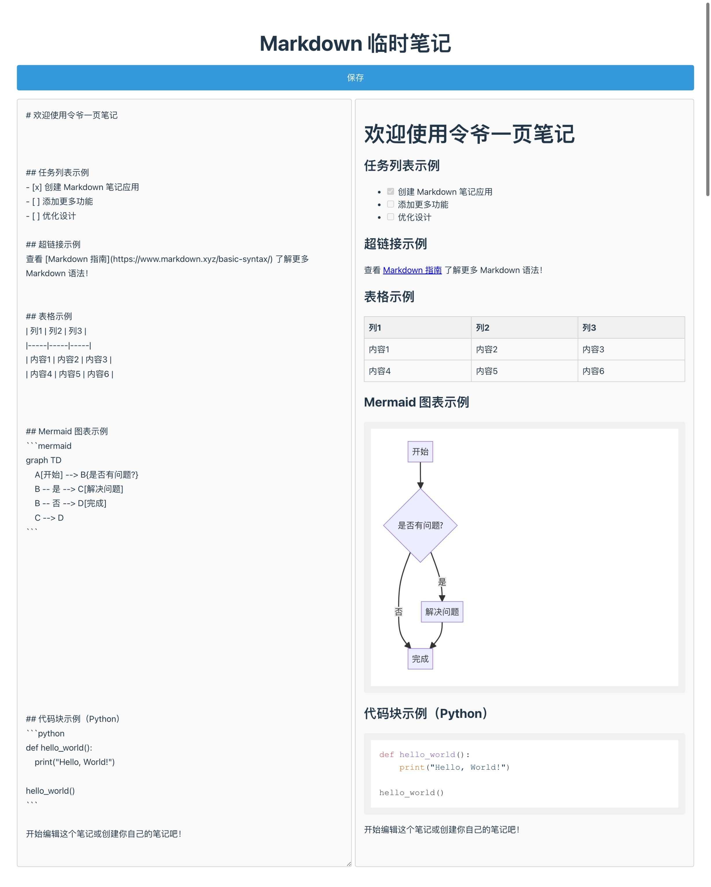

# OnePageMarkdownNote

OnePageMarkdownNote 是一个轻量级的、单页的临时笔记应用，它支持 Markdown 语法，并且能够保留笔记内容在服务器上。这个应用旨在为需要快速记录和查看笔记的用户提供一个简洁、高效的解决方案。

以下是 OnePageMarkdownNote 的一些核心特性：

## 特性概览

- **Markdown 支持**：OnePageMarkdownNote 支持标准的 Markdown 语法，包括但不限于标题、列表、加粗、斜体、链接、图片等。
- **Mermaid 集成**：应用内嵌了 Mermaid 支持，允许用户在笔记中绘制流程图、序列图、甘特图等，极大地增强了笔记的表达能力。
- **代码高亮**：为了更好地展示代码，OnePageMarkdownNote 提供了代码高亮功能，支持多种编程语言的语法高亮显示。
- **单页应用**：整个应用仅由一个 PHP 文件组成，无需复杂的后端逻辑或数据库，简化了部署和维护过程。
- **数据持久化**：笔记内容被保存在服务器上，用户可以随时访问和编辑自己的笔记，而不必担心数据丢失。

## 使用方法

1. **部署**：将 OnePageMarkdownNote 的 PHP 文件上传到您的服务器。
2. **访问**：在浏览器中输入服务器地址，即可开始使用。
3. **编辑笔记**：在文本框中输入 Markdown 格式的文本，应用会自动渲染为富文本。
4. **保存笔记**：编辑完成后，点击保存按钮，笔记内容将被保存在服务器上。
5. **查看笔记**：每次访问应用时，都会显示最新的笔记内容。

## 技术栈

- **PHP**：后端逻辑处理（也可以换成Node.js等）。
- **JavaScript**：前端交互和动态内容渲染。
- **Markdown**：文本标记语言，用于编写和格式化笔记内容。
- **Mermaid**：用于生成图表和流程图的 JavaScript 库。
- **Highlight.js**：用于代码高亮的 JavaScript 库。

## 考虑的开发的功能（怕影响现在的简洁性）

- [ ] 可以遍历notes文件夹，列举所有md文件。
- [ ] 点击可以读取不同的md文件，在保存按钮上面，最多6个。双击可以重命名,保存内容的同时保存文件名。

## 安装指南

1. **上传文件**：将 OnePageMarkdownNote 的 PHP 文件上传到您的服务器的适当目录。
2. **配置权限**：确保服务器上的目录具有写入权限，以便应用可以保存笔记内容。
3. **访问应用**：在浏览器中输入您的服务器地址，开始使用 OnePageMarkdownNote。

## 贡献

OnePageMarkdownNote 是一个开源项目，我们欢迎任何形式的贡献，包括但不限于代码提交、功能请求、bug 报告等。如果您有兴趣参与项目的开发，请访问我们的 [GitHub 仓库](https://github.com/yourusername/OnePageMarkdownNote)。

## 联系

- 作者：[令爷]
- 邮箱：[eden7@qq.com]
- 网站：[http://www.zengqueling.com](http://www.zengqueling.com)

---

OnePageMarkdownNote 是一个简单而强大的工具，它将帮助您更有效地管理和记录信息。无论是个人笔记还是团队协作，OnePageMarkdownNote 都是一个理想的选择。立即开始使用，体验 Markdown 笔记的魅力吧！
